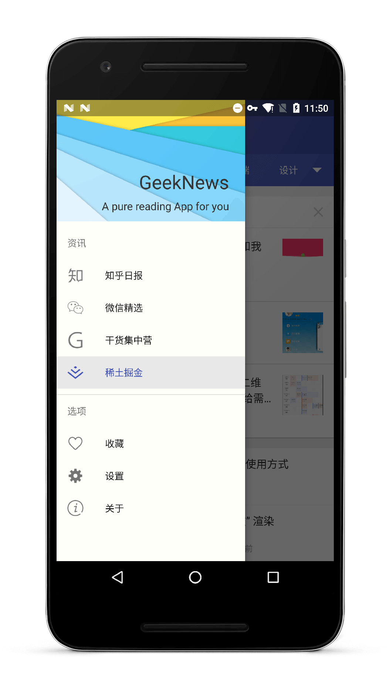

#GeekNews

GeekNews, A pure reading App based on Material Design + MVP + RxJava + Retrofit + Dagger2 + Realm + Glide

极客日报，一款纯粹的阅读App，基于Material Design + MVP + RxJava + Retrofit + Dagger2 + Realm + Glide

出于学习的目的做了这款Material Design风格的简洁的阅读应用，基本涵盖了当前Android端开发最常用的主流框架，阅读内容目前包括[知乎日报](http://daily.zhihu.com/)、[微信精选](http://www.tianapi.com/#wxnew)、[干货集中营](http://gank.io/)、[稀土掘金](https://gold.xitu.io/)，知识、新闻、福利一网打尽，后期会持续更新，坚持在这个项目上实践最新的技术，也会争取拓展更多的阅读内容

本项目还在测试阶段，发现bug或有好的建议欢迎[issue](https://github.com/codeestX/GeekNews/issues)、email(codeest.dev@gmail.com)、PR，如果感觉对你有帮助也欢迎点个star、fork，本项目仅做学习交流使用，API数据内容所有权归原作公司所有，请勿用于其他用途

###Preview

 &nbsp;&nbsp;&nbsp;
 &nbsp;&nbsp;&nbsp;

###[Download APK](http://fir.im/xt2f)
(Android 5.0 or above)

##Points

* 使用RxJava配合Retrofit2做网络请求
* 使用RxUtil对线程操作和网络请求结果处理做了封装
* 使用RxPresenter对订阅的生命周期做管理
* 使用RxBus来方便组件间的通信
* 使用RxJava其他操作符来做延时、轮询、转化、筛选等操作
* 使用okhttp3对网络返回内容做缓存，还有日志、超时重连、头部消息的配置
* 使用Material Design控件和动画
* 使用MVP架构整个项目，对应于model、ui、presenter三个包
* 使用Dagger2将M层注入P层，将P层注入V层，无需new，直接调用对象
* 使用Realm做阅读记录和收藏记录的增、删、查、改
* 使用Glide做图片的处理和加载
* 使用Fragmentation简化Fragment的操作和懒加载
* 使用RecyclerView实现下拉刷新、上拉加载、侧滑删除、长按拖曳
* 使用x5WebView做阅览页，比原生WebView体验更佳
* 使用SVG及其动画实现progressbar的效果
* 使用EasyPermissions做6.0+动态权限适配
* 使用原生的夜间模式、分享、反馈
* 包含搜索、收藏、检测更新等功能
* 所有踩到的坑都在项目里做了注释

##Version

###V1.2.0
1.新增 [稀土掘金](https://gold.xitu.io/)板块  
2.修复 部分已知BUG

###V1.1.0
1.使用 SVG动画替换了部分progressbar 
2.使用 [EasyPermissions](https://github.com/googlesamples/easypermissions)来做6.0+动态权限适配 
3.新增 版本更新检测、支付宝打赏 
4.调整 部分界面UI 
5.修复 部分已知BUG

###V1.0.1
1.感谢 [@kingkingruan](https://github.com/kingkingruan) 提出的过去切回今天日期未更新的bug，已修复 
2.使用 [x5WebView](http://x5.tencent.com/doc?id=1001) 替换原生WebView，更快更稳定 
3.更新微信精选API，免费次数貌似用完了...

###V1.0.0

1.提交第一版

##Thanks

###API:
[知乎日报API](https://github.com/izzyleung/ZhihuDailyPurify/wiki/%E7%9F%A5%E4%B9%8E%E6%97%A5%E6%8A%A5-API-%E5%88%86%E6%9E%90)&nbsp;&nbsp;&nbsp;&nbsp;&nbsp;[微信精选API](http://www.tianapi.com/#wxnew)&nbsp;&nbsp;&nbsp;&nbsp;&nbsp;[干货集中营API](http://gank.io/api)  
稀土掘金API为本人抓包获取，将掘金板块接入该应用有征得官方同意

###APP:
[Hot](https://github.com/zj-wukewei/Hot) 提供了Dagger2配合MVP的架构思路

[知了日报](https://github.com/HotBitmapGG/RxZhiHu) 提供了部分设计思路

还参考了很多大神的类似作品，感谢大家的开源精神

###RES:
[iconfont](http://www.iconfont.cn/) 提供了icon素材

[material UP](http://www.material.uplabs.com/) 提供了Material Design风格的素材

###LIB:
####UI
* [MaterialCalendarView](https://github.com/prolificinteractive/material-calendarview)
* [MaterialSearchView](https://github.com/MiguelCatalan/MaterialSearchView)
* [PhotoView](https://github.com/chrisbanes/PhotoView)
* [multiline-collapsingtoolbar](https://github.com/opacapp/multiline-collapsingtoolbar)
* [glide-transformations](https://github.com/wasabeef/glide-transformations)

####RX

* [RxJava](https://github.com/ReactiveX/RxJava)
* [RxAndroid](https://github.com/ReactiveX/RxAndroid)
* [RxBinding](https://github.com/JakeWharton/RxBinding)

####NETWORK

* [Retrofit](https://github.com/square/retrofit)
* [OkHttp](https://github.com/square/okhttp)
* [Glide](https://github.com/bumptech/glide)
* [Gson](https://github.com/google/gson)

####DI

* [Dagger2](https://github.com/google/dagger)
* [ButterKnife](https://github.com/JakeWharton/butterknife)

####FRAGMENT

* [Fragmentation](https://github.com/YoKeyword/Fragmentation)

####LOG

* [Logger](https://github.com/orhanobut/logger)

####DB

* [Realm](https://github.com/realm/realm-java)

####PERMISSION

* [EasyPermissions](https://github.com/googlesamples/easypermissions)

####CANARY

* [BlockCanary](https://github.com/markzhai/AndroidPerformanceMonitor)
* [LeakCanary](https://github.com/square/leakcanary)

##License

Copyright (c) 2016 codeestX

Permission is hereby granted, free of charge, to any person obtaining a copy of this software and associated documentation files (the "Software"), to deal in the Software without restriction, including without limitation the rights to use, copy, modify, merge, publish, distribute, sublicense, and/or sell copies of the Software, and to permit persons to whom the Software is furnished to do so, subject to the following conditions:

The above copyright notice and this permission notice shall be included in all copies or substantial portions of the Software.

THE SOFTWARE IS PROVIDED "AS IS", WITHOUT WARRANTY OF ANY KIND, EXPRESS OR IMPLIED, INCLUDING BUT NOT LIMITED TO THE WARRANTIES OF MERCHANTABILITY, FITNESS FOR A PARTICULAR PURPOSE AND NONINFRINGEMENT. IN NO EVENT SHALL THE AUTHORS OR COPYRIGHT HOLDERS BE LIABLE FOR ANY CLAIM, DAMAGES OR OTHER LIABILITY, WHETHER IN AN ACTION OF CONTRACT, TORT OR OTHERWISE, ARISING FROM, OUT OF OR IN CONNECTION WITH THE SOFTWARE OR THE USE OR OTHER DEALINGS IN THE SOFTWARE.